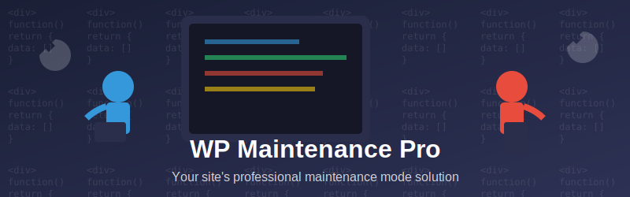
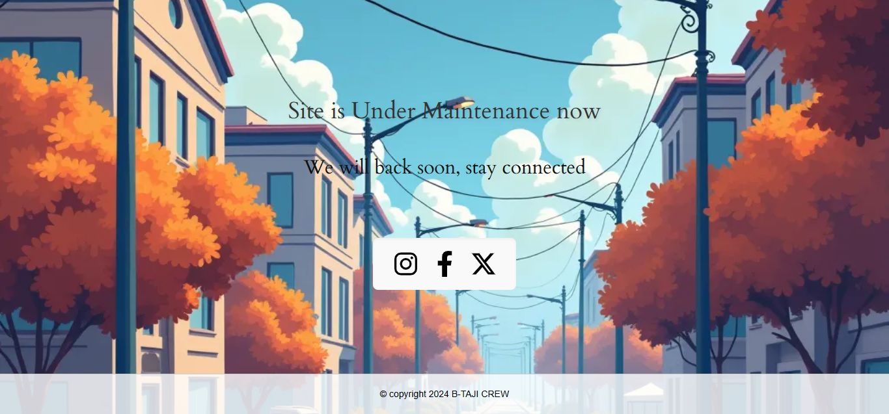

  

# 🛠️ WP Maintenance Pro

> Transform your WordPress maintenance mode into a personalized experience with page-specific controls, user whitelisting, and customizable design elements.

## ✨ Key Features

### 🎯 Page-Specific Maintenance Mode
- Enable maintenance mode on specific pages/posts
- Flexible URL input options:
  - Add URLs line by line
  - Use multi-select dropdown for easy page/post selection
- Keep your site partially accessible while working on specific sections

### 👥 User Whitelist Management
- Grant specific users access to the live site during maintenance
- Easy user selection through multi-select dropdown
- Perfect for team collaboration during site updates

### 🔗 Customizable Social Icons
- Add unlimited social media links
- For each social icon, customize:
  - Social media link URL
  - Custom icon upload
  - Background color selection
- Keep your audience connected during maintenance

### ✏️ Footer Customization
- Rich text editor for footer content
- Custom color picker for font styling
- Perfect for copyright notices and additional information

### 🎨 Design Features
- Custom background image upload
- Responsive design for all devices
- Modern and clean interface

## 🚀 Installation

1. Download the plugin ZIP file
2. Go to WordPress admin → Plugins → Add New
3. Click "Upload Plugin" and select the downloaded ZIP
4. Activate the plugin
5. Navigate to Settings → Maintenance Mode

## ⚙️ Configuration

### Basic Setup
1. Navigate to Settings → Maintenance Mode
2. Enable maintenance mode
3. Select target pages/posts
4. Configure user whitelist
5. Customize Footer

### Design Customization
1. Go to Maintenance Mode
2. Customize text colors
3. Customize:
   - Social icons
   - Footer text
   - Background image
   - Color schemes

## 📱 Preview

  

## 👥 Meet Our Amazing Team

<table>
  <tr>
    <td align="center">
      <a href="https://www.linkedin.com/in/ahmad-fakhar-357742258/"> <b>Ahmad Fakhar</b> </a> 
      
      
        </td>
    <td align="center">
      <a href="http://www.linkedin.com/in/tayyab-sajjad-156ab2267"> <b>Tayyab Sajjiad</b> </a> 
      
      
    </td>
  <td align="center">
      <a href="https://www.linkedin.com/in/muhammad-ibrahim-qasmi-9876a1297/"> <b>Muhammad Ibrahim</b> </a> 
      
      
    </td>
   <td align="center"> 
  <a href="https://www.linkedin.com/in/"> <b>Muhammad Bilal</b> </a> 
  
  
</td>
</table>

## 🤝 Contributing

Contributions are welcome! Please feel free to submit a Pull Request.

1. Fork the repository
2. Create your feature branch (`git checkout -b feature/AmazingFeature`)
3. Commit your changes (`git commit -m 'Add some AmazingFeature'`)
4. Push to the branch (`git push origin feature/AmazingFeature`)
5. Open a Pull Request

## 📝 License

Distributed under the GPLv2 license. See `LICENSE` for more information.

## 📧 Support

Having issues? [Open an issue](https://github.com/yourusername/wp-maintenance-pro/issues) or contact us through our support channels.

---

 
Made with ❤️ by Team B-TAJI
 
© 2024 WP Maintenance. All rights reserved.
 
 
